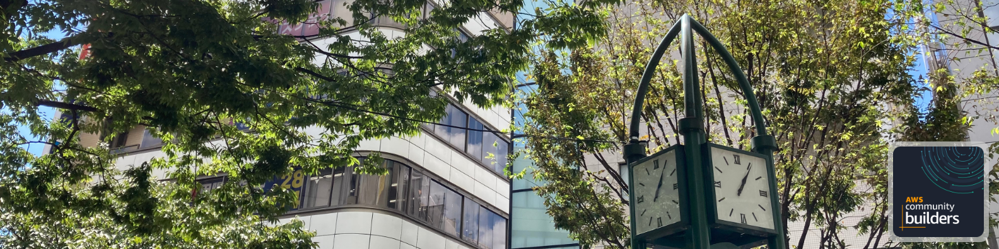
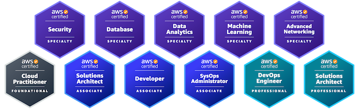
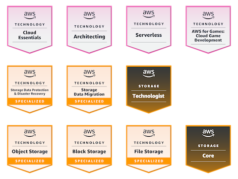
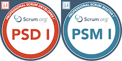

Hi there, I'm Shigeki Shoji.

Cloud Consultant | Cloud Solutions Architect | Translator | Speaker | 13X AWS Certified

[Credly](https://www.credly.com/users/username.835c802c/badges):

* Linkedin: https://www.linkedin.com/in/takesection/
* Twitter: https://twitter.com/takesection
* InfoQ: https://www.infoq.com/profile/Shoji-Shigeki/, https://www.infoq.com/profile/-Shoji-Shigeki/
* Medium: https://medium.com/@shigeki-shoji
* Hatena: https://s-edword.hatenablog.com/
