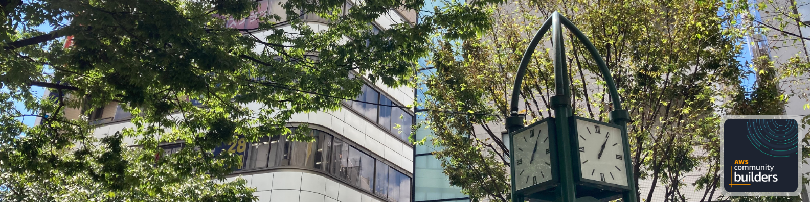
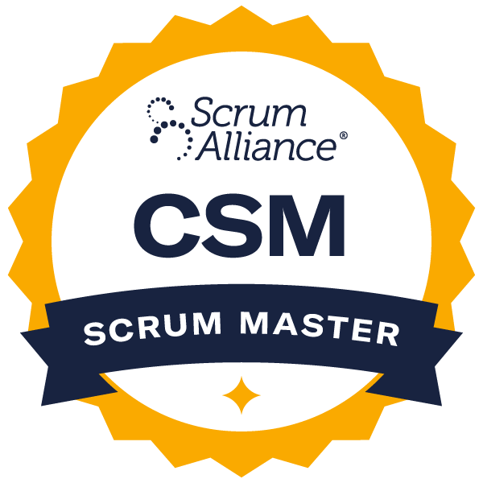

Hi there, I'm Shigeki Shoji (ORCID 0009−0003−0447−5011).

Instructional Designer (IDer) | Agile Coach | Financial Planner

### [DLC](https://www.elc.or.jp/)

- eLP Basic (DLC-certified e-Learning Professional)
- [eLP SCORM Engineer (DLC-certified e-Learning Professional)](https://www.elc.or.jp/edtech/scorm/list/)

### [ScrumAlliance](https://www.scrumalliance.org/members/1669015)

### [Scrum.org](https://www.scrum.org/user/1214997)

  
