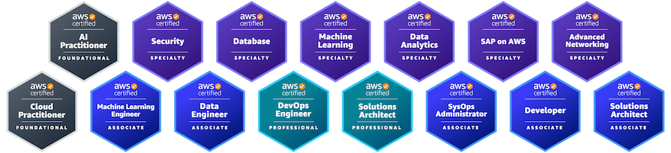

Hi there, I'm Shigeki Shoji.

Instructional Designer | Agile Coach | AWS Authorized Instructor

### [DLC](https://www.elc.or.jp/)

- eLP Basic (DLC-certified e-Learning Professional)

### [AWS (15x AWS Certified)](https://aws.amazon.com/certification/)

### [Microsoft Credentials](https://learn.microsoft.com/en-us/credentials/)

- [Azure AI Engineer Associate](https://learn.microsoft.com/api/credentials/share/ja-jp/ShigekiShoji-0896/7B152AA68B21D341)
- [Azure AI Fundamentals](https://learn.microsoft.com/api/credentials/share/ja-jp/ShigekiShoji-0896/FEB3566E4ED5C37F)

### [ScrumAlliance](https://www.scrumalliance.org/)

### [Scrum.org](https://www.scrum.org/)

## SNS and Blog

- Linkedin: https://www.linkedin.com/in/takesection/
- X: https://x.com/takesection
- Hatena: https://s-edword.hatenablog.com/

## Badges

- [Credly](https://www.credly.com/users/username.835c802c/badges)
- [OpenBadges](https://www.openbadge-global.com/ns/portal/openbadge/public/assertions/user/TTZpNlI3R2FzaW9GZ0JFd1FodnZUdz09)
